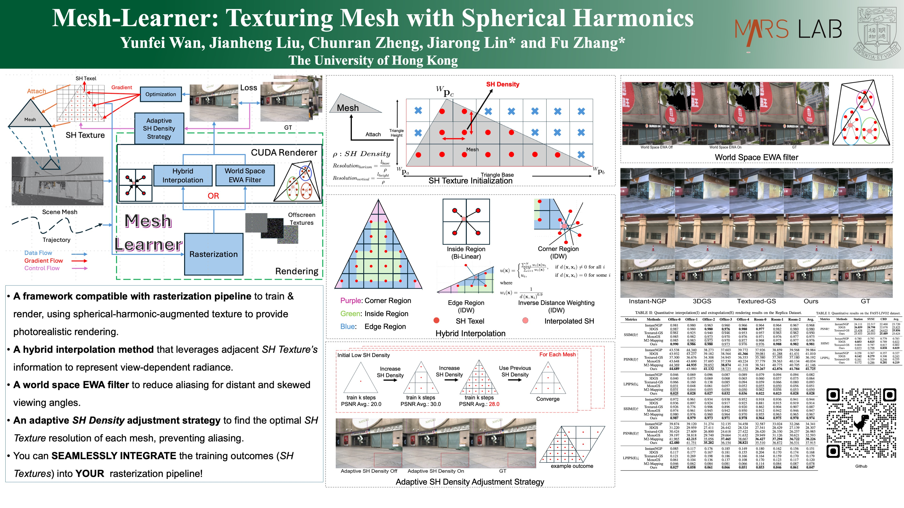

## Mesh-Learner: Texturing Mesh with Spherical Harmonics
<small><strong>Yunfei Wan</strong>, Jianheng Liu, Chunran Zheng, Jiarong Lin, Fu Zhang</small>

 
Mesh-Learner is a framework natively compatible with traditional rasterization pipelines that integrates mesh and spherical harmonic (SH) Texture (i.e., texture filled with SH coefficients) into the learning process to learn each mesh’s view-dependent radiance end-to-end.
 
 
<a href="https://github.com/hku-mars/Mesh-Learner">GS-SDF</a>